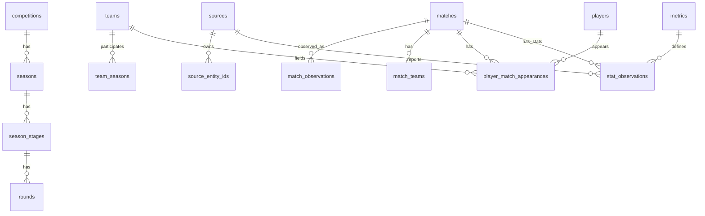

# Database Schema Design

Date: 2026-06-20

Purpose: store Israeli soccer data from multiple providers while preserving source-specific observations. The schema should let us later decide whether to trust one source, average sources, reconcile manually, or show source differences in the UI.

Recommended database: PostgreSQL.

## Design Principles

1. Canonical entities are stable app concepts:
   - country
   - competition
   - season
   - stage/round
   - team
   - player
   - venue
   - match

2. Source entities are provider-specific observations:
   - 365Scores game `4702057`
   - football.co.il match id
   - FotMob match id
   - 365Scores athlete id
   - FotMob player id

3. Never overwrite provider data when providers disagree.
   Instead, store source values in observation tables and resolve them through views/materialized views.

4. Metrics are dictionary-driven, not column-driven.
   A new provider stat should usually be a new `metric` row and `stat_observation` rows, not a migration.

5. Keep v1 lean for Supabase Free.
   Store processed source observations, not raw provider payloads or request-level audit logs.

## High-Level Shape

## Schemas

Use three logical schemas:

- `core`: canonical application entities.
- `source`: provider identity and source-to-canonical mapping.
- `obs`: source observations and metrics.

This can be actual PostgreSQL schemas or just table prefixes. Actual schemas are cleaner.

## Source Tables

### `source.sources`

One row per provider.

Columns:

- `id uuid primary key`
- `code text unique not null`  
  Example: `365scores`, `football_co_il`, `fotmob`, `sofascore`
- `name text not null`
- `kind text not null`  
  Example: `unofficial_web_api`, `official_site`, `paid_api`, `manual`
- `base_url text`
- `is_active boolean not null default true`
- `priority integer not null default 100`  
  Lower number means preferred by default.
- `metadata jsonb not null default '{}'`
- `created_at timestamptz not null default now()`
- `updated_at timestamptz not null default now()`

### `source.source_entity_ids`

Maps source IDs to canonical entities. This is the glue table that lets multiple sources point to the same app-level match/team/player.

Columns:

- `id uuid primary key`
- `source_id uuid not null references source.sources(id)`
- `entity_type text not null`  
  Example: `competition`, `season`, `team`, `player`, `match`, `venue`, `metric`
- `source_entity_id text not null`
- `canonical_table text`
- `canonical_id uuid`
- `source_name text`
- `source_slug text`
- `confidence numeric(5,4) not null default 1.0`
- `mapping_status text not null default 'auto'`  
  Example: `auto`, `confirmed`, `rejected`, `needs_review`
- `first_seen_at timestamptz not null default now()`
- `last_seen_at timestamptz not null default now()`
- `metadata jsonb not null default '{}'`

Indexes:

- unique: `(source_id, entity_type, source_entity_id)`
- index: `(entity_type, canonical_id)`
- index: `(mapping_status)`

## Core Tables

### `core.countries`

Columns:

- `id uuid primary key`
- `name text not null`
- `iso2 text`
- `iso3 text`

### `core.competitions`

Canonical competition, for example Ligat Ha'Al.

Columns:

- `id uuid primary key`
- `country_id uuid references core.countries(id)`
- `name text not null`
- `name_he text`
- `competition_type text not null`  
  Example: `league`, `cup`, `super_cup`
- `gender text default 'men'`
- `metadata jsonb not null default '{}'`

### `core.seasons`

Columns:

- `id uuid primary key`
- `competition_id uuid not null references core.competitions(id)`
- `name text not null`  
  Example: `2025/26`
- `start_date date`
- `end_date date`
- `metadata jsonb not null default '{}'`

Unique:

- `(competition_id, name)`

### `core.season_stages`

Examples: regular season, championship playoff, relegation playoff.

Columns:

- `id uuid primary key`
- `season_id uuid not null references core.seasons(id)`
- `name text not null`
- `stage_type text`  
  Example: `regular`, `playoff`, `group`
- `stage_number integer`
- `metadata jsonb not null default '{}'`

Unique:

- `(season_id, stage_number)`

### `core.rounds`

Columns:

- `id uuid primary key`
- `stage_id uuid not null references core.season_stages(id)`
- `round_number integer`
- `name text`
- `metadata jsonb not null default '{}'`

Unique:

- `(stage_id, round_number)`

### `core.teams`

Canonical club.

Columns:

- `id uuid primary key`
- `name text not null`
- `name_he text`
- `short_name text`
- `city text`
- `founded_year integer`
- `primary_color text`
- `secondary_color text`
- `metadata jsonb not null default '{}'`

### `core.team_seasons`

Team participation in a competition season.

Columns:

- `id uuid primary key`
- `team_id uuid not null references core.teams(id)`
- `season_id uuid not null references core.seasons(id)`
- `display_name text`
- `metadata jsonb not null default '{}'`

Unique:

- `(team_id, season_id)`

### `core.players`

Canonical player identity.

Columns:

- `id uuid primary key`
- `display_name text not null`
- `display_name_he text`
- `date_of_birth date`
- `country_id uuid references core.countries(id)`
- `primary_position text`
- `preferred_foot text`
- `metadata jsonb not null default '{}'`

### `core.player_team_stints`

Useful for historical roster and transfer context.

Columns:

- `id uuid primary key`
- `player_id uuid not null references core.players(id)`
- `team_id uuid not null references core.teams(id)`
- `season_id uuid references core.seasons(id)`
- `start_date date`
- `end_date date`
- `shirt_number integer`
- `metadata jsonb not null default '{}'`

### `core.venues`

Columns:

- `id uuid primary key`
- `name text not null`
- `city text`
- `country_id uuid references core.countries(id)`
- `capacity integer`
- `metadata jsonb not null default '{}'`

### `core.matches`

Canonical match identity.

Columns:

- `id uuid primary key`
- `season_id uuid not null references core.seasons(id)`
- `stage_id uuid references core.season_stages(id)`
- `round_id uuid references core.rounds(id)`
- `venue_id uuid references core.venues(id)`
- `scheduled_at timestamptz`
- `status text`
- `home_team_id uuid references core.teams(id)`
- `away_team_id uuid references core.teams(id)`
- `home_score integer`
- `away_score integer`
- `metadata jsonb not null default '{}'`
- `created_at timestamptz not null default now()`
- `updated_at timestamptz not null default now()`

Indexes:

- `(season_id, scheduled_at)`
- `(home_team_id, scheduled_at)`
- `(away_team_id, scheduled_at)`

### `core.match_teams`

One row per team per match. This simplifies team stats and future neutral/home-away quirks.

Columns:

- `id uuid primary key`
- `match_id uuid not null references core.matches(id)`
- `team_id uuid not null references core.teams(id)`
- `opponent_team_id uuid references core.teams(id)`
- `side text not null`  
  Example: `home`, `away`, `neutral`
- `score integer`
- `is_winner boolean`
- `red_cards integer`
- `formation text`
- `coach_name text`
- `metadata jsonb not null default '{}'`

Unique:

- `(match_id, team_id)`
- `(match_id, side)`

### `core.player_match_appearances`

Canonical appearance row. This is the anchor for player-match stats.

Columns:

- `id uuid primary key`
- `match_id uuid not null references core.matches(id)`
- `player_id uuid not null references core.players(id)`
- `team_id uuid not null references core.teams(id)`
- `opponent_team_id uuid references core.teams(id)`
- `side text`
- `shirt_number integer`
- `lineup_status text`  
  Example: `starting`, `substitute`, `bench`, `unknown`
- `position_name text`
- `formation_position text`
- `minutes_played numeric(5,2)`
- `metadata jsonb not null default '{}'`

Unique:

- `(match_id, player_id, team_id)`

## Metric Tables

### `obs.metrics`

Dictionary of canonical metrics.

Columns:

- `id uuid primary key`
- `code text unique not null`  
  Example: `passes_completed`, `passes_attempted`, `pass_completion_pct`, `expected_goals`
- `name text not null`
- `subject_type text not null`  
  Example: `player_match`, `team_match`, `match`, `player_season`, `team_season`
- `value_type text not null`  
  Example: `count`, `percentage`, `rating`, `duration`, `expected_value`, `text`
- `unit text`
- `higher_is_better boolean`
- `description text`
- `metadata jsonb not null default '{}'`

Important modeling choice:

For compound source values like `14/22 (64%)`, store separate metric observations:

- `passes_completed = 14`
- `passes_attempted = 22`
- `pass_completion_pct = 64`

Keep the provider's scalar `raw_value` string too, but do not store full raw payloads or make the app parse strings at query time.

### `obs.source_metric_mappings`

Maps provider stat names/IDs to canonical metrics.

Columns:

- `id uuid primary key`
- `source_id uuid not null references source.sources(id)`
- `source_metric_id text`
- `source_metric_name text not null`
- `canonical_metric_id uuid references obs.metrics(id)`
- `parser text`  
  Example: `number`, `percentage`, `made_attempted_percentage`, `minutes_apostrophe`
- `mapping_status text not null default 'auto'`
- `metadata jsonb not null default '{}'`

Unique:

- `(source_id, source_metric_name, coalesce(source_metric_id, ''))`

## Observation Tables

### `obs.match_observations`

Source-specific facts about a match. This lets football.co.il and 365Scores disagree on kickoff time, venue, score, status, etc.

Columns:

- `id uuid primary key`
- `source_id uuid not null references source.sources(id)`
- `match_id uuid references core.matches(id)`
- `source_match_id text not null`
- `observed_at timestamptz not null default now()`
- `scheduled_at timestamptz`
- `status text`
- `home_source_team_id text`
- `away_source_team_id text`
- `home_score integer`
- `away_score integer`
- `venue_name text`
- `round_name text`

Unique:

- `(source_id, source_match_id, observed_at)`

### `obs.player_appearance_observations`

Source-specific lineup/appearance facts.

Columns:

- `id uuid primary key`
- `source_id uuid not null references source.sources(id)`
- `appearance_id uuid references core.player_match_appearances(id)`
- `match_id uuid references core.matches(id)`
- `player_id uuid references core.players(id)`
- `team_id uuid references core.teams(id)`
- `source_match_id text not null`
- `source_player_id text not null`
- `source_team_id text`
- `observed_at timestamptz not null default now()`
- `lineup_status text`
- `position_name text`
- `formation_name text`
- `shirt_number integer`
- `rating numeric(6,3)`
- `heatmap_url text`

Index:

- `(source_id, source_match_id, source_player_id)`

### `obs.stat_observations`

The central fact table. Every source-reported stat lands here.

Columns:

- `id uuid primary key`
- `source_id uuid not null references source.sources(id)`
- `metric_id uuid not null references obs.metrics(id)`
- `subject_type text not null`  
  Example: `player_match`, `team_match`, `match`, `player_season`, `team_season`
- `subject_id uuid`  
  Points to the canonical row for the subject, such as `player_match_appearances.id` or `match_teams.id`.
- `match_id uuid references core.matches(id)`
- `team_id uuid references core.teams(id)`
- `player_id uuid references core.players(id)`
- `season_id uuid references core.seasons(id)`
- `source_subject_id text`
- `source_metric_id text`
- `source_metric_name text`
- `value_numeric numeric(18,6)`
- `value_text text`
- `raw_value text`
- `observed_at timestamptz not null default now()`
- `confidence numeric(5,4) not null default 1.0`

Indexes:

- `(subject_type, subject_id, metric_id)`
- `(match_id, metric_id)`
- `(player_id, metric_id, match_id)`
- `(team_id, metric_id, match_id)`
- `(source_id, source_subject_id, source_metric_name)`

Why this table is narrow:

- It accepts new metrics without migrations.
- It keeps multiple providers side by side.
- It stores the current observation for each source/subject/metric. Repeated seed runs update the same row.

### `obs.events`

Optional but useful later for goals, cards, substitutions, shots, VAR events.

Columns:

- `id uuid primary key`
- `source_id uuid not null references source.sources(id)`
- `match_id uuid references core.matches(id)`
- `source_event_id text`
- `event_type text not null`
- `minute integer`
- `second integer`
- `period text`
- `team_id uuid references core.teams(id)`
- `player_id uuid references core.players(id)`
- `related_player_id uuid references core.players(id)`
- `x numeric(8,4)`
- `y numeric(8,4)`
- `value numeric(18,6)`

### `obs.heatmaps`

Keep heatmaps separate because providers may expose URLs, compressed coordinates, or image assets.

Columns:

- `id uuid primary key`
- `source_id uuid not null references source.sources(id)`
- `appearance_id uuid references core.player_match_appearances(id)`
- `match_id uuid references core.matches(id)`
- `player_id uuid references core.players(id)`
- `url text`
- `data jsonb`
- `image_path text`
- `observed_at timestamptz not null default now()`

## Resolved/Presentation Layer

Do not make the app query raw observation tables directly for common charts. Add views/materialized views that resolve values.

### `analytics.resolved_player_match_stats`

One row per player appearance per metric after source resolution.

Suggested columns:

- `appearance_id`
- `match_id`
- `season_id`
- `scheduled_at`
- `player_id`
- `team_id`
- `opponent_team_id`
- `metric_code`
- `value_numeric`
- `value_text`
- `resolution_method`
- `source_count`
- `chosen_source_id`
- `source_values jsonb`

Resolution methods:

- `preferred_source`: choose the first active source by priority.
- `average`: average numeric values across eligible sources.
- `median`: median numeric value across eligible sources.
- `manual`: value was manually corrected.
- `only_source`: only one source has the value.

### `analytics.player_match_wide`

Optional materialized view for UI performance. This can pivot the common player-match metrics:

- minutes
- rating
- goals
- assists
- expected_goals
- expected_assists
- passes_completed
- passes_attempted
- pass_completion_pct
- long_passes_completed
- long_passes_attempted
- key_passes
- touches
- tackles_won
- interceptions
- ball_recovery
- saves

This wide view is for reading only. The normalized observations remain the source of truth.

## Handling Source Conflicts

Example: 365Scores reports pass completion as `14/22 (64%)`, FotMob reports `15/23 (65%)`.

Store both:

- `obs.stat_observations`
  - source: `365scores`, metric: `passes_completed`, value: `14`
  - source: `365scores`, metric: `passes_attempted`, value: `22`
  - source: `365scores`, metric: `pass_completion_pct`, value: `64`
  - source: `fotmob`, metric: `passes_completed`, value: `15`
  - source: `fotmob`, metric: `passes_attempted`, value: `23`
  - source: `fotmob`, metric: `pass_completion_pct`, value: `65`

Then resolve later:

- Prefer official provider.
- Prefer provider with richer player data.
- Average percentages.
- Recompute percentage from resolved completed/attempted.
- Show discrepancy in an admin review screen.

Recommended default:

1. For atomic counts, use preferred-source resolution.
2. For percentages, recompute from resolved made/attempted where possible.
3. For ratings, keep source-specific ratings and do not average by default because rating formulas are proprietary and not comparable.
4. For xG/xA, do not average unless the metric mapping confirms similar methodology.

## Initial Canonical Metrics

Seed these first from 365Scores:

### Player Match Metrics

- `minutes`
- `rating_365`
- `goals`
- `assists`
- `expected_goals`
- `expected_assists`
- `expected_goals_on_target`
- `expected_goals_prevented`
- `total_shots`
- `shots_on_target`
- `shots_off_target`
- `shots_blocked`
- `hit_woodwork`
- `big_chances_created`
- `big_chances_missed`
- `big_chances_scored`
- `passes_completed`
- `passes_attempted`
- `pass_completion_pct`
- `long_passes_completed`
- `long_passes_attempted`
- `long_pass_completion_pct`
- `passes_into_final_third`
- `backward_passes`
- `key_passes`
- `crosses_completed`
- `crosses_attempted`
- `cross_completion_pct`
- `touches`
- `possession_lost`
- `successful_dribbles`
- `dribbles_attempted`
- `dribble_success_pct`
- `was_fouled`
- `fouls_made`
- `tackles_won`
- `tackles_attempted`
- `tackle_success_pct`
- `interceptions`
- `clearances`
- `ball_recovery`
- `final_third_possession_won`
- `aerial_duels_won`
- `aerial_duels_attempted`
- `aerial_duel_win_pct`
- `ground_duels_won`
- `ground_duels_attempted`
- `ground_duel_win_pct`
- `was_dribbled_past`
- `goalkeeper_saves`
- `goals_conceded`
- `penalties_saved`
- `penalties_faced`
- `high_claims`
- `punches`
- `played_sweeper`

### Team Match Metrics

Seed dynamically from `data/processed/365scores_team_match_stats.csv`, but normalize obvious core metrics:

- `possession_pct`
- `total_shots`
- `shots_on_target`
- `big_chances_created`
- `corners`
- `fouls`
- `yellow_cards`
- `red_cards`
- `passes_completed`
- `passes_attempted`
- `pass_completion_pct`
- `expected_goals`

## Ingestion Flow

For each source run:

1. Fetch provider payloads in the seeder process.
2. Transform payloads into canonical/source-aware rows.
3. Upsert source entity IDs for competition, season, teams, matches, players, metrics.
4. Link or create canonical entities:
   - teams by source ID first, then normalized name/season fallback
   - players by source ID first, then team/name/jersey fallback requiring review
   - matches by source ID first, then season/date/home/away fallback
5. Insert `match_observations`.
6. Upsert canonical `matches`, `match_teams`, and `player_match_appearances` where confidence is high.
7. Insert `player_appearance_observations`.
8. Insert `stat_observations` for each metric.
9. Refresh analytics materialized views.

## Practical First Migration

Build the first version in this order:

1. `source.sources`, `source.source_entity_ids`
2. `core.countries`, `core.competitions`, `core.seasons`, `core.season_stages`, `core.rounds`
3. `core.teams`, `core.players`, `core.matches`, `core.match_teams`, `core.player_match_appearances`
4. `obs.metrics`, `obs.source_metric_mappings`
5. `obs.match_observations`, `obs.player_appearance_observations`, `obs.stat_observations`
6. `analytics.resolved_player_match_stats`

Defer until needed:

- event table
- heatmap table
- roster/stint precision
- venue resolution
- admin review UI

## Why This Works For The Website

Question: "Did player X improve his pass accuracy?"

Query path:

1. Find `core.players.id`.
2. Query `analytics.resolved_player_match_stats` for:
   - `metric_code = 'pass_completion_pct'`
   - matches ordered by `scheduled_at`
3. Optionally also fetch:
   - `passes_completed`
   - `passes_attempted`
   - source values for confidence/disagreement badges

Question: "Which source should we trust?"

Query path:

1. Compare `obs.stat_observations` grouped by `source_id`.
2. Measure source coverage and disagreement by metric.
3. Change `source.sources.priority` or the metric-specific resolution policy.

## Open Decisions

- Whether source resolution should be global, per competition, or per metric.
- Whether ratings from different providers should be separate metrics.
- Whether xG/xA from different providers should ever be averaged.
- Whether canonical player matching should require manual review when no source ID match exists.
